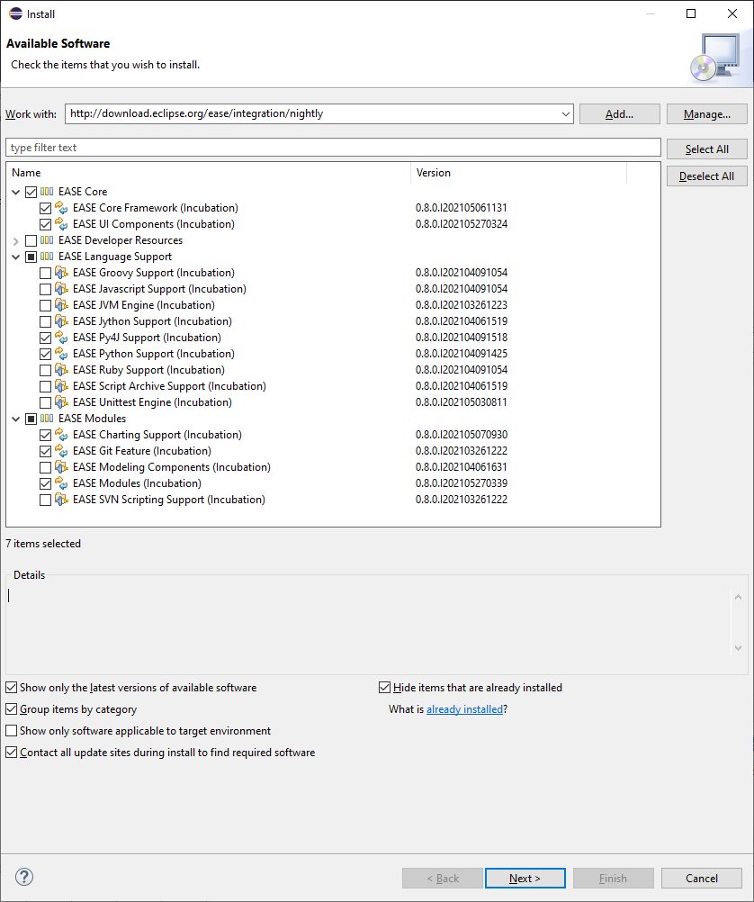
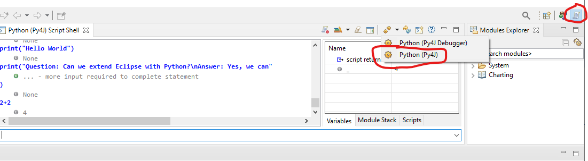

EASE Python Tutorial  
=====================
The Eclipse Advanced Scripting Environment (EASE) makes it very easy to extend and control the Eclipse IDE using the popular scripting language Python.

[Join the chat at EASE on Mattermost](https://mattermost-test.eclipse.org/eclipse/channels/ease)

This tutorial shows you how to set-up and use Python scripting with EASE. Once you have setup, open the [tutorial](EASE.htm).

Pre-requisites
---------------
* Java 11 with a JDK
* Python installed and runnable from the path
* The NumPy Python package is required to run the NumPy part of the tutorial.

To install Java we can recommend getting it from [AdoptOpenJDK](https://adoptopenjdk.net/) or your package manager.

To install Python we can recommend getting it from [Python.org](https://www.python.org/downloads/) or your package manager.

To install Python and NumPy we can recommend the [Anaconda Python distribution](https://www.anaconda.com/products/individual).

Set-up
---------------

Here are manual steps to obtain EASE. 

* Install [Eclipse IDE for Committers 2020-12](https://www.eclipse.org/downloads/packages/release/2020-12/r/eclipse-ide-eclipse-committers) *Do not use 2021-03 of Eclipse - see [Bug 572102](https://bugs.eclipse.org/bugs/show_bug.cgi?id=572102) for details*
* Download & install [EASE](https://www.eclipse.org/ease/download/)
    - To install EASE successfully you will need the following p2 sites available in Preferences -> Install/Update -> Available Software Sites
        - http://download.eclipse.org/ease/release/latest (for Python >= 3.8 you may need the nightly build http://download.eclipse.org/ease/integration/nightly - see [Bug 553457](https://bugs.eclipse.org/bugs/show_bug.cgi?id=553457))
        - https://download.eclipse.org/tools/orbit/downloads/drops/R20201130205003/repository
        - https://eclipse.py4j.org/
        - http://download.eclipse.org/nebula/releases/1.3.0/
    - The EASE components needed for the tutorial are
        * EASE Core Framework
        * EASE UI Components
        * EASE Py4J Support
        * EASE Python Support
        * EASE Charting Support
        * EASE Git Feature
        * EASE Modules
        * Screenshot:

* Install [PyDev](http://www.pydev.org/download.html). This step is optional, but provides a nice editor for writing Python scripts. 

Configuration
---------------
Launch Eclipse (eclipse.exe) and switch to the Scripting perspective. If not already selected, change the script shell to 'Python (Py4J))':

Switch to the Git perspective, clone this repository https://github.com/jonahgraham/EASE-Python-Examples.git and import all existing projects into your workspace.

By default, EASE will use Python off your System Path. If you need to specify a different Python, you can change this in Preferences->Scripting->Python Scripting->Python location.

Optionally, you can configure the PyDev interpreter to point to the same version of Python (for file editing).

Release Notes
-------------

 * 2021-05-27: Update links and bring tutorial up to date.
 * 2016-07-21: Fix bug where EASE overwrote PYTHONPATH, PYTHONPATH is now extended with path to py4j-python sources
 * 2016-07-21: Merge current upstream EASE code, updated product to be based on Neon.0
 * 2016-07-01: Current version on dropbox rebuilt with new Py4J (release 0.10.2.1).
